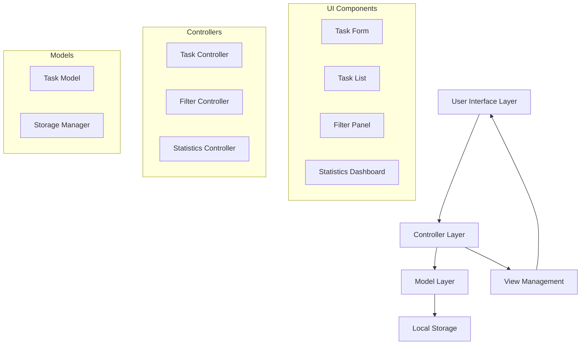

# Design Document: eProject Task Management System

## Overview

The eProject Task Management System is a single-page application (SPA) built using JavaScript, Bootstrap, and jQuery that provides comprehensive task management capabilities. The application follows a modular architecture with clear separation of concerns between data management, user interface, and business logic. The system leverages HTML5 localStorage for data persistence, ensuring tasks remain available across browser sessions without requiring a backend server.

The application implements a component-based architecture where each major feature (task creation, filtering, statistics) is encapsulated in its own module. This approach enhances maintainability and allows for easy extension of functionality. The design prioritizes user experience through responsive design, real-time updates, and intuitive interactions.

## Architecture

### High-Level Architecture

The application follows a Model-View-Controller (MVC) pattern adapted for client-side development:



### Technology Stack Integration

- **Bootstrap 5**: Provides responsive grid system, pre-built components, and consistent styling
- **jQuery 3.x**: Handles DOM manipulation, event binding, and AJAX-like operations for localStorage
- **Vanilla JavaScript**: Implements business logic, data models, and application state management
- **HTML5 localStorage**: Serves as the persistence layer for task data
- **CSS3**: Custom styling to enhance Bootstrap components and provide application-specific theming

### Data Flow Architecture

1. **User Interaction**: User performs action (create task, filter, etc.)
2. **Event Handling**: jQuery captures DOM events and delegates to appropriate controller
3. **Business Logic**: Controller processes the action and updates the model
4. **Data Persistence**: Model synchronizes changes with localStorage
5. **View Update**: Controller triggers view refresh to reflect changes
6. **UI Feedback**: Bootstrap components provide visual feedback to user

## Components and Interfaces

### Core Components

#### TaskManager (Main Application Controller)
```javascript
class TaskManager {
    constructor()
    init()
    bindEvents()
    refreshDisplay()
}
```

**Responsibilities:**
- Initialize application and all sub-components
- Coordinate between different modules
- Handle global application state
- Manage application lifecycle

#### Task Model
```javascript
class Task {
    constructor(id, description, priority, dueDate, category, completed)
    validate()
    toJSON()
    static fromJSON(data)
}
```

**Properties:**
- `id`: Unique identifier (UUID)
- `description`: Task description text
- `priority`: Enum (Low, Medium, High)
- `dueDate`: Date object or null
- `category`: String category name
- `completed`: Boolean completion status
- `createdAt`: Timestamp of creation
- `completedAt`: Timestamp of completion (if applicable)

#### StorageManager (Data Persistence Layer)
```javascript
class StorageManager {
    static save(tasks)
    static load()
    static clear()
    static export()
    static import(data)
}
```

**Responsibilities:**
- Handle all localStorage operations
- Serialize/deserialize task data
- Manage data integrity and validation
- Provide backup/restore functionality

#### TaskController (Task Operations)
```javascript
class TaskController {
    constructor(storageManager, viewManager)
    createTask(taskData)
    updateTask(id, updates)
    deleteTask(id)
    toggleComplete(id)
    getTasks(filters)
}
```

**Responsibilities:**
- Handle CRUD operations for tasks
- Validate task data before persistence
- Emit events for view updates
- Manage task state transitions

#### FilterController (Search and Filtering)
```javascript
class FilterController {
    constructor(taskController)
    applyFilters(criteria)
    searchTasks(query)
    filterByStatus(status)
    filterByCategory(category)
    clearFilters()
}
```

**Filter Criteria:**
- Text search in task descriptions
- Completion status (all, completed, pending)
- Category selection
- Priority level
- Due date ranges

#### StatisticsController (Analytics and Reporting)
```javascript
class StatisticsController {
    constructor(taskController)
    calculateCompletionRate()
    getTasksByCategory()
    getOverdueTasks()
    getProductivityMetrics()
    updateDashboard()
}
```

**Metrics Provided:**
- Total tasks count
- Completion percentage
- Tasks by category distribution
- Overdue tasks count
- Daily/weekly productivity trends

### User Interface Components

#### Task Form Component
- Bootstrap form with validation styling
- Real-time validation feedback
- Date picker integration
- Category dropdown with dynamic options
- Priority selection with visual indicators

#### Task List Component
- Bootstrap card-based layout for tasks
- Drag-and-drop functionality for reordering
- Inline editing capabilities
- Completion toggle with animations
- Delete confirmation modals

#### Filter Panel Component
- Bootstrap accordion for organized filters
- Search input with live filtering
- Category checkboxes
- Status radio buttons
- Date range picker for due dates

#### Statistics Dashboard Component
- Bootstrap progress bars for completion rates
- Chart.js integration for visual analytics
- Real-time metric updates
- Responsive card layout for different metrics

## Data Models

### Task Entity Schema

```javascript
{
    id: "uuid-string",
    description: "string (1-500 characters)",
    priority: "low" | "medium" | "high",
    dueDate: "ISO-8601 date string" | null,
    category: "string (1-50 characters)",
    completed: boolean,
    createdAt: "ISO-8601 timestamp",
    completedAt: "ISO-8601 timestamp" | null,
    tags: ["string array"],
    notes: "string (optional)"
}
```

### Application State Schema

```javascript
{
    tasks: [Task],
    filters: {
        searchQuery: "string",
        status: "all" | "completed" | "pending",
        categories: ["string array"],
        priorities: ["string array"],
        dateRange: {
            start: "date" | null,
            end: "date" | null
        }
    },
    settings: {
        theme: "light" | "dark",
        sortBy: "dueDate" | "priority" | "created" | "alphabetical",
        sortOrder: "asc" | "desc"
    }
}
```

### LocalStorage Data Structure

```javascript
{
    "taskManager_tasks": "[serialized Task array]",
    "taskManager_settings": "{serialized settings object}",
    "taskManager_categories": "[array of category names]",
    "taskManager_version": "1.0.0"
}
```

## Correctness Properties

*A property is a characteristic or behavior that should hold true across all valid executions of a system—essentially, a formal statement about what the system should do. Properties serve as the bridge between human-readable specifications and machine-verifiable correctness guarantees.*

Let me analyze the acceptance criteria to determine which ones are testable as properties:

<function_calls>
<invoke name="prework">
<parameter name="featureName">eproject-web-application