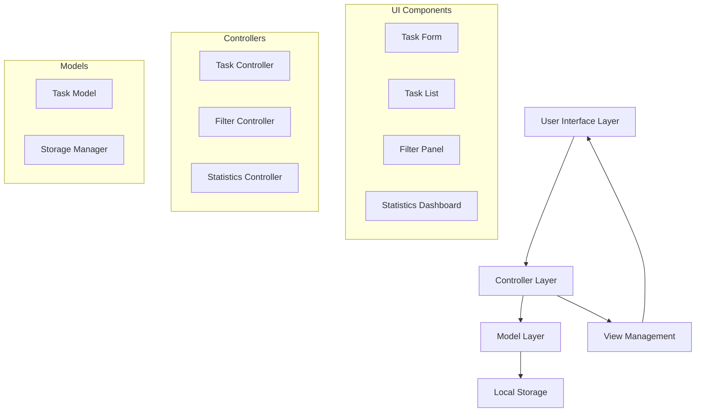

# Design Document: eProject Task Management System

## Overview

The eProject Task Management System is a single-page application (SPA) built using JavaScript, Bootstrap, and jQuery that provides comprehensive task management capabilities. The application follows a modular architecture with clear separation of concerns between data management, user interface, and business logic. The system leverages HTML5 localStorage for data persistence, ensuring tasks remain available across browser sessions without requiring a backend server.

The application implements a component-based architecture where each major feature (task creation, filtering, statistics) is encapsulated in its own module. This approach enhances maintainability and allows for easy extension of functionality. The design prioritizes user experience through responsive design, real-time updates, and intuitive interactions.

## Architecture

### High-Level Architecture

The application follows a Model-View-Controller (MVC) pattern adapted for client-side development:



### Technology Stack Integration

- **Bootstrap 5**: Provides responsive grid system, pre-built components, and consistent styling
- **jQuery 3.x**: Handles DOM manipulation, event binding, and AJAX-like operations for localStorage
- **Vanilla JavaScript**: Implements business logic, data models, and application state management
- **HTML5 localStorage**: Serves as the persistence layer for task data
- **CSS3**: Custom styling to enhance Bootstrap components and provide application-specific theming

### Data Flow Architecture

1. **User Interaction**: User performs action (create task, filter, etc.)
2. **Event Handling**: jQuery captures DOM events and delegates to appropriate controller
3. **Business Logic**: Controller processes the action and updates the model
4. **Data Persistence**: Model synchronizes changes with localStorage
5. **View Update**: Controller triggers view refresh to reflect changes
6. **UI Feedback**: Bootstrap components provide visual feedback to user

## Components and Interfaces

### Core Components

#### TaskManager (Main Application Controller)
```javascript
class TaskManager {
    constructor()
    init()
    bindEvents()
    refreshDisplay()
}
```

**Responsibilities:**
- Initialize application and all sub-components
- Coordinate between different modules
- Handle global application state
- Manage application lifecycle

#### Task Model
```javascript
class Task {
    constructor(id, description, priority, dueDate, category, completed)
    validate()
    toJSON()
    static fromJSON(data)
}
```

**Properties:**
- `id`: Unique identifier (UUID)
- `description`: Task description text
- `priority`: Enum (Low, Medium, High)
- `dueDate`: Date object or null
- `category`: String category name
- `completed`: Boolean completion status
- `createdAt`: Timestamp of creation
- `completedAt`: Timestamp of completion (if applicable)

#### StorageManager (Data Persistence Layer)
```javascript
class StorageManager {
    static save(tasks)
    static load()
    static clear()
    static export()
    static import(data)
}
```

**Responsibilities:**
- Handle all localStorage operations
- Serialize/deserialize task data
- Manage data integrity and validation
- Provide backup/restore functionality

#### TaskController (Task Operations)
```javascript
class TaskController {
    constructor(storageManager, viewManager)
    createTask(taskData)
    updateTask(id, updates)
    deleteTask(id)
    toggleComplete(id)
    getTasks(filters)
}
```

**Responsibilities:**
- Handle CRUD operations for tasks
- Validate task data before persistence
- Emit events for view updates
- Manage task state transitions

#### FilterController (Search and Filtering)
```javascript
class FilterController {
    constructor(taskController)
    applyFilters(criteria)
    searchTasks(query)
    filterByStatus(status)
    filterByCategory(category)
    clearFilters()
}
```

**Filter Criteria:**
- Text search in task descriptions
- Completion status (all, completed, pending)
- Category selection
- Priority level
- Due date ranges

#### StatisticsController (Analytics and Reporting)
```javascript
class StatisticsController {
    constructor(taskController)
    calculateCompletionRate()
    getTasksByCategory()
    getOverdueTasks()
    getProductivityMetrics()
    updateDashboard()
}
```

**Metrics Provided:**
- Total tasks count
- Completion percentage
- Tasks by category distribution
- Overdue tasks count
- Daily/weekly productivity trends

### User Interface Components

#### Task Form Component
- Bootstrap form with validation styling
- Real-time validation feedback
- Date picker integration
- Category dropdown with dynamic options
- Priority selection with visual indicators

#### Task List Component
- Bootstrap card-based layout for tasks
- Drag-and-drop functionality for reordering
- Inline editing capabilities
- Completion toggle with animations
- Delete confirmation modals

#### Filter Panel Component
- Bootstrap accordion for organized filters
- Search input with live filtering
- Category checkboxes
- Status radio buttons
- Date range picker for due dates

#### Statistics Dashboard Component
- Bootstrap progress bars for completion rates
- Chart.js integration for visual analytics
- Real-time metric updates
- Responsive card layout for different metrics

## Data Models

### Task Entity Schema

```javascript
{
    id: "uuid-string",
    description: "string (1-500 characters)",
    priority: "low" | "medium" | "high",
    dueDate: "ISO-8601 date string" | null,
    category: "string (1-50 characters)",
    completed: boolean,
    createdAt: "ISO-8601 timestamp",
    completedAt: "ISO-8601 timestamp" | null,
    tags: ["string array"],
    notes: "string (optional)"
}
```

### Application State Schema

```javascript
{
    tasks: [Task],
    filters: {
        searchQuery: "string",
        status: "all" | "completed" | "pending",
        categories: ["string array"],
        priorities: ["string array"],
        dateRange: {
            start: "date" | null,
            end: "date" | null
        }
    },
    settings: {
        theme: "light" | "dark",
        sortBy: "dueDate" | "priority" | "created" | "alphabetical",
        sortOrder: "asc" | "desc"
    }
}
```

### LocalStorage Data Structure

```javascript
{
    "taskManager_tasks": "[serialized Task array]",
    "taskManager_settings": "{serialized settings object}",
    "taskManager_categories": "[array of category names]",
    "taskManager_version": "1.0.0"
}
```

## Correctness Properties

*A property is a characteristic or behavior that should hold true across all valid executions of a system—essentially, a formal statement about what the system should do. Properties serve as the bridge between human-readable specifications and machine-verifiable correctness guarantees.*

Based on the prework analysis, here are the key correctness properties for the system:

### Property 1: Task Creation with Unique IDs
*For any* valid task description, creating a task should result in a new task with a unique ID being added to the task list
**Validates: Requirements 1.1**

### Property 2: Empty Task Rejection
*For any* string composed entirely of whitespace or empty content, attempting to create a task should be rejected and the task list should remain unchanged
**Validates: Requirements 1.2**

### Property 3: Task Property Assignment
*For any* task and any valid property values (priority, due date, category), setting these properties should result in the task storing and displaying the correct values
**Validates: Requirements 1.3, 1.4, 1.5**

### Property 4: Task Status Management
*For any* task, marking it as complete, editing its properties, or deleting it should result in the appropriate state changes and display updates
**Validates: Requirements 2.1, 2.2, 2.3**

### Property 5: Completion Toggle Round-trip
*For any* task, toggling completion status twice should return the task to its original state
**Validates: Requirements 2.4**

### Property 6: Storage Persistence Round-trip
*For any* set of tasks, saving to localStorage and then loading should produce an equivalent set of tasks with all properties preserved
**Validates: Requirements 3.1, 3.2, 3.4, 3.5**

### Property 7: Graceful Error Handling
*For any* corrupted localStorage data, the application should handle the error gracefully and initialize with empty data without crashing
**Validates: Requirements 3.3**

### Property 8: Filter Correctness
*For any* filter criteria and task set, applying the filter should display only tasks that match all specified criteria
**Validates: Requirements 4.1, 4.2, 4.3, 4.4**

### Property 9: Filter Clear Restoration
*For any* applied filters, clearing all filters should restore the display to show all tasks
**Validates: Requirements 4.5**

### Property 10: Statistics Accuracy
*For any* set of tasks, calculated statistics (count, completion percentage, category distribution, overdue detection) should accurately reflect the current task data
**Validates: Requirements 6.1, 6.2, 6.3, 6.4, 6.5**

### Property 11: Form Validation and Submission
*For any* form data, submitting should trigger proper validation and handle the submission without page refresh
**Validates: Requirements 7.2**

### Property 12: Error Message Display
*For any* error condition, the system should display appropriate user-friendly error messages
**Validates: Requirements 7.4**

### Property 13: Component Initialization
*For any* application load, all interactive components and event handlers should be properly initialized
**Validates: Requirements 7.5**

### Property 14: Export Data Completeness
*For any* set of tasks, exporting should generate a JSON file containing all task data and properties
**Validates: Requirements 8.1, 8.4**

### Property 15: Import Data Validation and Merging
*For any* valid import file, the data should be validated and properly merged with existing tasks
**Validates: Requirements 8.2**

### Property 16: Import Conflict Resolution
*For any* import data containing conflicts, the system should handle duplicates appropriately without data loss
**Validates: Requirements 8.3**

### Property 17: Import Error Handling
*For any* invalid import file format, the system should display error messages and preserve existing data
**Validates: Requirements 8.5**

## Error Handling

### Error Categories and Responses

#### Data Validation Errors
- **Empty Task Description**: Display inline validation message, prevent form submission
- **Invalid Date Format**: Show date picker validation, suggest correct format
- **Missing Required Fields**: Highlight required fields, provide clear guidance

#### Storage Errors
- **localStorage Quota Exceeded**: Notify user, offer data export/cleanup options
- **localStorage Access Denied**: Graceful fallback to session-only mode
- **Corrupted Data**: Clear corrupted data, initialize fresh, notify user of reset

#### Import/Export Errors
- **Invalid File Format**: Display format requirements, provide example
- **File Read Errors**: Show file access error, suggest retry
- **Large File Handling**: Progress indicators, chunked processing for large datasets

#### Network and Performance Errors
- **Slow Performance**: Loading indicators, progressive enhancement
- **Memory Issues**: Pagination for large task lists, lazy loading
- **Browser Compatibility**: Feature detection, graceful degradation

### Error Recovery Strategies

1. **Automatic Recovery**: System attempts to recover from transient errors
2. **User Notification**: Clear, actionable error messages with recovery steps
3. **Data Preservation**: Always preserve user data during error conditions
4. **Fallback Modes**: Reduced functionality rather than complete failure

## Testing Strategy

### Dual Testing Approach

The application will use both unit testing and property-based testing to ensure comprehensive coverage:

**Unit Tests**: Focus on specific examples, edge cases, and integration points
- Test specific task creation scenarios
- Verify error handling for known edge cases
- Test component integration and event handling
- Validate UI interactions and feedback

**Property-Based Tests**: Verify universal properties across all inputs using JSVerify library
- Generate random task data to test properties across wide input ranges
- Verify system behavior holds for all valid inputs
- Test invariants and round-trip properties
- Ensure comprehensive coverage through randomization

### Property-Based Testing Configuration

- **Library**: JSVerify for JavaScript property-based testing
- **Test Iterations**: Minimum 100 iterations per property test
- **Test Tagging**: Each property test tagged with format: **Feature: eproject-web-application, Property {number}: {property_text}**
- **Coverage**: Each correctness property implemented as a single property-based test

### Testing Framework Setup

```javascript
// Example property test structure
describe('Task Management Properties', () => {
    it('Property 1: Task Creation with Unique IDs', () => {
        // Feature: eproject-web-application, Property 1: Task Creation with Unique IDs
        jsc.assertForall(jsc.string, (description) => {
            // Property test implementation
        });
    });
});
```

### Unit Test Categories

1. **Component Tests**: Individual component functionality
2. **Integration Tests**: Component interaction and data flow
3. **UI Tests**: User interface behavior and responsiveness
4. **Storage Tests**: localStorage operations and data persistence
5. **Validation Tests**: Input validation and error handling

### Test Environment

- **Framework**: Jest for unit testing, JSVerify for property-based testing
- **DOM Testing**: jsdom for DOM manipulation testing
- **Mocking**: localStorage mocking for consistent test environment
- **Coverage**: Aim for 90%+ code coverage with focus on critical paths

The testing strategy ensures both specific functionality works correctly (unit tests) and that the system maintains correctness across all possible inputs (property tests), providing comprehensive validation of the task management system.